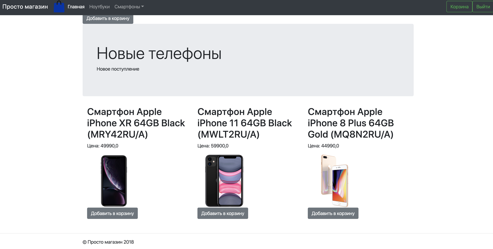

# Дипломный проект по курсу «Django: создание функциональных веб-приложений»

## Задача

Разработать сайт интернет-магазина. (Должна быть реализована клиентская часть сервиса и интерфейс администрирования.)

## Реализовано

* Реализована корзина, регистрация, вход, отображение категорий, коллекций



## Интерфейс администратора

* Редактирование товаров, категорий, заказов, подборок

## Документация по проекту

Для запуска проекта необходимо:

Установить зависимости:
```bash
pip install -r requirements.txt
```

Выполнить следующие команды:

* Команда для создания миграций приложения для базы данных
```bash
python manage.py migrate
```

* Команда для загрузки данных в БД
```bash
python manage.py loaddata db.json
```

* Команда для запуска приложения
```bash
python manage.py runserver
```

* Доступ в админку

Логин: admin

Пароль: admin
